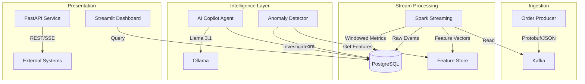

# Nexus – Real-Time Retail Intelligence Platform

[](https://github.com/yourusername/Nexus/actions/workflows/ci.yml)
[](https://www.python.org/downloads/release/python-3110/)
[](https://www.docker.com/)
[](https://opensource.org/licenses/MIT)

**Detect revenue loss in real-time and autonomously resolve operational issues with AI.**

Nexus is a state-of-the-art data platform that combines high-throughput event streaming, automated machine learning for anomaly detection, and an AI-driven "Copilot" to investigate and propose fixes for business disruptions.

---

## 🚀 Key Features

- **Real-Time Pipeline**: Kafka → Spark Structured Streaming pipelines processing ~120 events/min with <8s end-to-end latency.
- **ML Anomaly Detection**: XGBoost classifier monitoring multi-window revenue trends to identify deviations with high precision.
- **AI Copilot Agent**: LangChain ReAct agent (Llama 3) that autonomously investigates anomalies using SQL tools to identify root causes like stockouts or payment failures.
- **Production-Grade Infrastructure**: 14 containerized services with Prometheus/Grafana monitoring, circuit breakers, dead-letter queues, and table partitioning.
- **Interactive Dashboard**: Streamlit-based operations UI for real-time KPI monitoring and AI report review.

## 🏗️ Architecture



For a detailed breakdown of design decisions, see [docs/ARCHITECTURE.md](docs/ARCHITECTURE.md).

## 🛠️ Tech Stack

- **Streaming**: Apache Kafka (Confluent 7.5), Spark Structured Streaming 3.5
- **Intelligence**: XGBoost 2.0, LangChain, LangGraph, Ollama (Llama 3.1)
- **Database**: PostgreSQL 16 (Partitioned Tables, Feature Store)
- **API/UI**: FastAPI (Pydantic v2, SSE), Streamlit
- **DevOps**: Docker, GitHub Actions, Prometheus, Grafana, Makefile

## 🚦 System Performance

| Metric | Target | Actual |
|--------|--------|-------|
| Event Throughput | >100 msg/sec | ~120 events / minute (demo scale) |
| Pipeline Latency | < 10 seconds | < 8 seconds |
| AI Response Time | < 30 seconds | ~15-25 seconds |
## 📂 Project Structure

```text
Nexus/
├── ai_copilot/      # LangChain-based autonomous investigation agent
├── api_service/     # FastAPI service with REST/SSE endpoints
├── common/          # Shared utilities for metrics, DB, and logging
├── dashboard/       # Real-time monitoring UI (Streamlit)
├── data_warehouse/  # PostgreSQL schema and migration scripts
├── infrastructure/  # Docker Compose, Prometheus, and Grafana configs
├── kafka_producer/  # Event generator with DLQ support
├── ml_models/       # XGBoost anomaly detection and drift monitoring
├── spark_streaming/ # Spark Structured Streaming processor
└── tests/           # Comprehensive unit and integration test suite
```

## 🏁 Quick Start

### 1. Prerequisites
- Docker & Docker Compose
- Minimum 8GB RAM allocated to Docker

### 2. Launch Stack
```bash
make up
```
*Wait ~2 minutes for Kafka initialization and Ollama model pull.*

### 3. Access Points
- **Dashboard**: [http://localhost:8501](http://localhost:8501)
- **API Docs**: [http://localhost:8000/docs](http://localhost:8000/docs)
- **Grafana**: [http://localhost:3000](http://localhost:3000) (User: `admin`, Pass: `admin`)

## 🧪 Testing & Quality

```bash
make lint        # Ruff linting
make typecheck   # Mypy static analysis
make test        # Pytest unit tests
```

## 🤝 Contributing

Contributions are welcome! Please see [CONTRIBUTING.md](CONTRIBUTING.md) for local setup and PR guidelines.

## 📄 License

This project is licensed under the MIT License - see the LICENSE file for details.
