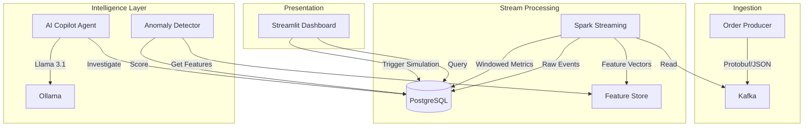

# Nexus – Real-Time Retail Intelligence & Autonomous Operations Platform

A real-time data platform that detects revenue loss using streaming analytics and autonomously proposes operational fixes using an AI copilot.

## Architecture



## System Performance

| Metric | Value |
|--------|-------|
| Event Throughput | ~120 events / minute |
| End-to-End Latency | < 8 seconds |
| ML Scoring Interval | 60 seconds |
| Copilot Scan Interval | 90 seconds |
| LLM Response Time | ~15-25 seconds (Llama 3.1) |

## Data Flow

1. **Event Ingestion** – A Python producer generates realistic retail order events (~2/sec) and publishes them to Kafka's `order_events` topic.
2. **Stream Processing** – Spark Structured Streaming reads from Kafka, writes raw events to PostgreSQL, computes 5-minute windowed revenue aggregations, and updates a feature store with multi-window metrics.
3. **Anomaly Detection** – An XGBoost classifier trained on synthetic historical data scores new revenue windows every 60 seconds. Anomalies are tagged with severity (critical/high/medium) and written to the `anomalies` table.
4. **AI Investigation** – A LangChain ReAct agent powered by Llama 3 picks up unresolved anomalies, investigates them using SQL tools (category revenue, product volume, payment breakdowns, feature trends), and writes structured reports with root cause, confidence, estimated loss, and recommended actions.
5. **Dashboard** – A Streamlit UI displays KPI cards, revenue charts, anomaly alerts, and AI copilot reports. Auto-refreshes every 30 seconds.

## Tech Stack

| Layer | Technology |
|-------|-----------|
| Event Streaming | Apache Kafka (Confluent 7.5) |
| Stream Processing | Spark Structured Streaming 3.5 |
| Data Warehouse | PostgreSQL 16 |
| Machine Learning | XGBoost 2.0 |
| AI Agent | LangChain + LangGraph + Llama 3 (via Ollama) |
| Dashboard | Streamlit |
| Infrastructure | Docker / Docker Compose |
| Language | Python 3.11 |

## Project Structure

```
Nexus/
├── kafka_producer/          # Event generator
│   ├── Dockerfile
│   ├── requirements.txt
│   └── producer.py
│
├── spark_streaming/         # Stream processing (Kafka → PostgreSQL)
│   ├── Dockerfile
│   └── stream_processor.py
│
├── data_warehouse/          # PostgreSQL schema
│   └── init.sql             # 5 tables, 9 indexes
│
├── ml_models/               # Anomaly detection pipeline
│   ├── Dockerfile
│   ├── requirements.txt
│   ├── entrypoint.sh
│   ├── generate_training_data.py
│   ├── train_model.py
│   └── detect_anomalies.py
│
├── ai_copilot/              # LLM investigation agent
│   ├── Dockerfile
│   ├── requirements.txt
│   ├── tools.py             # 7 SQL investigation tools
│   └── copilot.py
│
├── dashboard/               # Operations UI
│   ├── Dockerfile
│   ├── requirements.txt
│   └── app.py
│
├── infrastructure/          # Docker Compose orchestration
│   └── docker-compose.yml
│
└── README.md
```

## Setup & Run

### Prerequisites

- Docker and Docker Compose installed
- At least 8 GB RAM available for Docker (Ollama + Spark are memory-intensive)

### Quick Start

```bash
cd Nexus/infrastructure
docker compose up --build
```

### Kafka/ZooKeeper Quick Recovery

If Kafka fails on startup with a ZooKeeper `NodeExistsException` (stale `/brokers/ids/1` session), run:

```powershell
cd Nexus
powershell -ExecutionPolicy Bypass -File .\infrastructure\scripts\reset-kafka-zk.ps1
```

Optional full recreate mode:

```powershell
cd Nexus
powershell -ExecutionPolicy Bypass -File .\infrastructure\scripts\reset-kafka-zk.ps1 -Full
```

If you use `make`:

```bash
make kafka-reset
make kafka-reset-full
```

### Startup Order (automatic via health checks)

1. Zookeeper → Kafka → health check passes
2. PostgreSQL starts, runs `init.sql` schema migration
3. `kafka-init` creates the `order_events` topic (3 partitions)
4. Producer begins streaming order events
5. Spark connects to Kafka + PostgreSQL, starts 3 streaming queries
6. Anomaly detector generates training data, trains XGBoost, enters scoring loop
7. Ollama starts, `ollama-init` pulls Llama 3 model
8. AI copilot connects to Ollama + PostgreSQL, begins investigating anomalies
9. Dashboard starts serving on port 8501

### Access Points

| Service | URL |
|---------|-----|
| Dashboard | http://localhost:8501 |
| Kafka (host access) | localhost:9092 |
| PostgreSQL | localhost:5432 (user: `nexus`, password: `nexus_password`) |
| Ollama API | localhost:11434 |

### Verify Data Flow

```bash
# Check Kafka events
docker exec nexus-kafka kafka-console-consumer \
  --bootstrap-server localhost:9092 \
  --topic order_events --max-messages 3

# Check PostgreSQL tables
docker exec nexus-postgres psql -U nexus -d nexus -c "SELECT count(*) FROM order_events;"
docker exec nexus-postgres psql -U nexus -d nexus -c "SELECT * FROM revenue_metrics ORDER BY window_start DESC LIMIT 5;"
docker exec nexus-postgres psql -U nexus -d nexus -c "SELECT * FROM anomalies ORDER BY detected_at DESC LIMIT 5;"
docker exec nexus-postgres psql -U nexus -d nexus -c "SELECT id, severity, confidence, estimated_loss, root_cause FROM copilot_reports ORDER BY created_at DESC LIMIT 3;"
docker exec nexus-postgres psql -U nexus -d nexus -c "SELECT * FROM feature_store ORDER BY computed_at DESC LIMIT 5;"
```

## Database Schema

| Table | Written By | Purpose |
|-------|-----------|---------|
| `order_events` | Spark | Raw event audit trail |
| `revenue_metrics` | Spark | 5-min windowed aggregations (category x region) |
| `feature_store` | Spark | Multi-window features (5m, 15m, 60m) for ML |
| `anomalies` | Anomaly Detector | ML-detected revenue anomalies with severity |
| `copilot_reports` | AI Copilot | Investigation reports with root cause, confidence, and actions |

## Example System Output

### Anomaly Detection

```
[ALERT] Scan #12: detected 2 anomalies!
  CRITICAL | Electronics      | North-India | actual=₹84.50 vs expected=₹840.00 (score=0.943)
  HIGH     | Footwear         | East-India  | actual=₹22.10 vs expected=₹104.00 (score=0.871)
```

### AI Copilot Report

```
ANOMALY REPORT
==============
Anomaly ID: 42
Severity: critical
Category: Electronics
Region: North-India
Revenue Impact: actual ₹84.50 vs expected ₹840.00 (89.9% drop)
Estimated Loss: ₹2,267.00
Confidence: 0.87

Root Cause Analysis:
Electronics revenue in North-India dropped to 10% of expected levels.
Product analysis shows iPhone 15 Pro and MacBook Air M3 have zero
orders in the last 30 minutes, suggesting a stockout event.

Recommended Action:
Create emergency purchase orders for iPhone 15 Pro (200 units) and
MacBook Air M3 (100 units) for the North-India distribution center.
```

## Key Engineering Decisions

- **Persisted Spark checkpoints** – Streaming state survives container restarts via Docker volume. Kafka offsets are tracked, so no events are lost or reprocessed.
- **Feature store** – Multi-window features (5m/15m/60m revenue, order counts, trend momentum) provide the ML model and copilot with richer signals than single-window metrics.
- **Structured copilot output** – Confidence scores and estimated loss make reports actionable. High confidence (>0.8) means multiple data sources confirmed the cause.
- **Local LLM** – Ollama serves Llama 3 on-premise. No API keys, no external dependencies, no data leaving the network.
- **Health check chain** – Every service waits for its dependencies via Docker health checks. The system self-heals with `restart: on-failure`.
