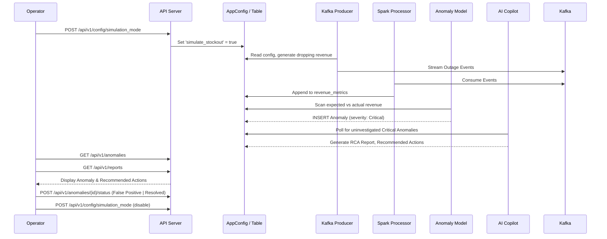

# Architecture: Full Incident Loop

This document outlines the architecture of a full incident lifecycle in the Nexus platform, from detection of a business disruption to AI-assisted root-cause analysis, human remediation, and ML model governance.

## Sequence Diagram

Below is the interaction flow when a simulated outage triggers an anomaly.

## Review & Remediation Protocol

When an alert is fired via **Prometheus** (e.g., `HighAnomalyRate`, `ModelDriftDetected`):
1. The operator uses the **Dashboard** to examine the AI recommendation.
2. The operator marks the status as **Resolved** (confirming it's an anomaly) or **False Positive**.
3. **Model Retraining:** Running `ml_models/retrain_production_model.py` fetches only Confirmed anomalies. False positives are ignored, preserving data integrity.
4. **Drift Detection:** Running `ml_models/drift_monitor.py --auto-retrain` tracks shifts in expected payload baselines and PSI, restarting training workflows automatically without human triggers if needed.
5. **Rollback System:** If performance drops or the `candidate_v{timestamp}` F1 score does not match expectations, operators execute `ml_models/rollback_model.py --timestamp {id}` to hot-reload previous model configurations within 60s.
